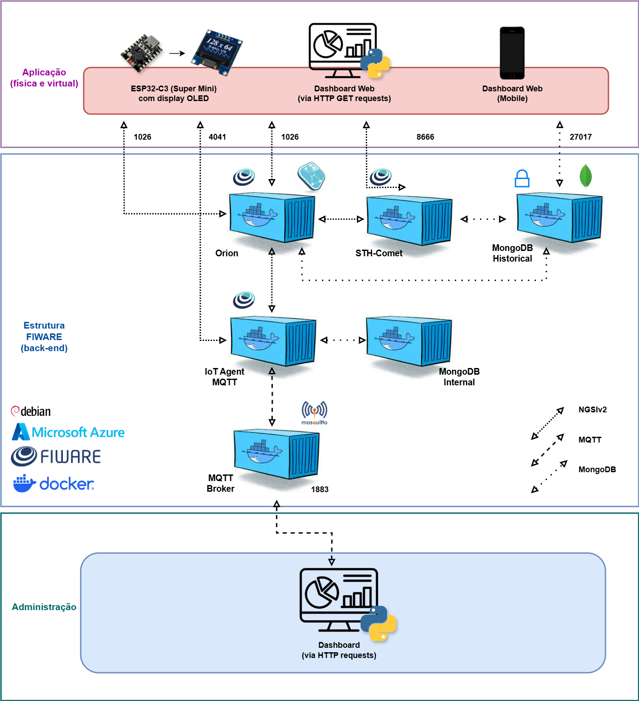
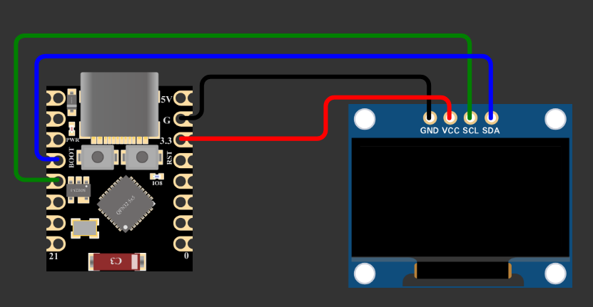

# Sprint 4 - Challenge Hospital Sabará - Brinquedo com Painel Infantil de Atendimento com ESP32-C3 SuperMini e Display OLED usando FIWARE

## Mestre: 
- Professor Fábio Cabrini

## Membros do Grupo - **Moskitto**:
- [**Ana Luiza**](https://github.com/anarand) - RM561194
- [**Gabriel Couto**](https://github.com/rouri404) - RM559579
- [**Gabriel Kato**](https://github.com/kato8088) - RM560000
- [**João Vitor**](https://github.com/joaomatosq) - RM559246

## Objetivo
O projeto é composto por um brinquedo interativo impresso em 3D no formato de gatinho, equipado com um ESP32-C3 SuperMini e um display OLED. O brinquedo é entregue à criança junto com o responsável e exibe a senha de atendimento da criança, informando quando chegar o atendimento, tudo de forma lúdica e acolhedora. Na altura atual do projeto, serve como modelo de estilo e comportamento para o gatinho virtual, como se fosse um _digital twin_.

## Componentes Utilizados:
- ESP32-C3 SuperMini
- Display OLED - SSD1306 - Resolução de 128x64 pixels

## Tecnologias Utilizadas:
- FIWARE
  - MQTT (IoT Agent e Broker)
  - Orion Context Broker
  - MongoDB
  - STH-Comet
- Microsoft Azure
  - Máquina Virtual rodando o FIWARE (Debian/Linux)
  - Interface de Rede (IP Público)
- Linguagem de programação C++
- Docker (Containers FIWARE)

## Diagrama da Arquitetura

## Arquitetura da Solução

A solução é baseada em uma arquitetura de 3 camadas:

1. **IoT (Dispositivo Físico):**

Brinquedo em forma de gatinho, com:

- ESP32-C3 SuperMini
- Display OLED SSD1306 (128x64 pixels)

Realiza requisição HTTP GET para o Orion Context Broker a cada 20 segundos.

Atualiza o texto exibido conforme o valor do atributo text da entidade Display001.

2. **Back-End (FIWARE hosteado no Microsoft Azure)**

Componente/Container Orion Context Broker na porta 1026.

Armazena e disponibiliza a entidade Display001 com o atributo text, do tipo String.

Interface REST API via NGSIv2.

3. **Aplicação**

Painel web / aplicativo de gestão mobile que envia atualizações para o Context Broker via requisições HTTP (Postman por enquanto).

Comunicação via HTTP na porta 1026 com cabeçalhos Fiware-Service e Fiware-ServicePath.

## Montagem do Projeto:

## Link para a Simulação no Wokwi
### Nota importante sobre a Simulação do Wokwi:
- A funcionalidade dos olhos dinâmicos no display requer uma biblioteca que não está no Wokwi ([RoboEyes](https://github.com/FluxGarage/RoboEyes)) portanto as animações dos olhos foram removidas da simulação do Wokwi.
- Demonstramos a funcionalidade no nosso [vídeo do YouTube](https://www.youtube.com/watch?v=teB0mU251rQ).
Link da Simulação: https://wokwi.com/projects/433667751877696513

## [Vídeo no YouTube](https://www.youtube.com/watch?v=teB0mU251rQ)
